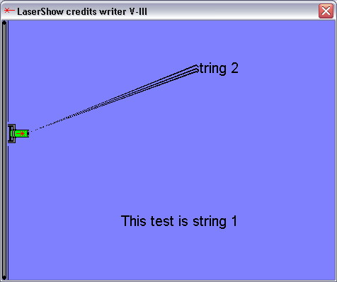



## Laser Credits Writer V3

### Description

This is a credits screen with effect! (see screenshot)

It will draw texts with are strings in code (no pictures) so they can also be changed at runtime!

Easy to understand code with much comments..

It's really cool, just trie it!!
 
### More Info
 

             |
---                |---
**Submitted On**   |2002-05-02 11:18:10
**By**             |[Peter Hebels](https://github.com/Planet-Source-Code/PSCIndex/blob/master/ByAuthor/peter-hebels.md)
**Level**          |Advanced
**User Rating**    |4.9 (49 globes from 10 users)
**Compatibility**  |VB 5\.0, VB 6\.0
**Category**       |[Graphics](https://github.com/Planet-Source-Code/PSCIndex/blob/master/ByCategory/graphics__1-46.md)
**World**          |[Visual Basic](https://github.com/Planet-Source-Code/PSCIndex/blob/master/ByWorld/visual-basic.md)
**Archive File**   |[Laser\_Cred78652522002\.zip](https://github.com/Planet-Source-Code/peter-hebels-laser-credits-writer-v3__1-34368/archive/master.zip)

### API Declarations

Some like BitBlt and sleep, see code

